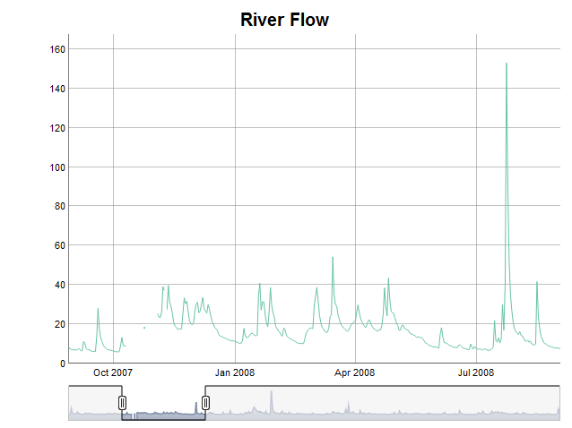

```{r setup, include=FALSE}
knitr::opts_chunk$set(
  collapse = TRUE,
  comment = "#>"
)
```

This vignette introduces the `DTSg` package, shows how to create objects of its main as well as only class and explains their two interfaces: R6 as code and S3 in comments. Familiarity with the `data.table` package helps better understanding certain parts of the vignette, but is not essential to follow it.

---

## Object Creation

First, let's load some data. The package is shipped with a `data.table` containing a daily time series of river flows:

```{r}
library(data.table)
library(DTSg)

data(flow)
flow
summary(flow)
```

Now that we have a data set, we can create our first object by providing it to the `new` method of the package's main R6 class generator `DTSg`. In addition, we specify an ID in order to give the new object a name:

```{r}
TS <- DTSg$new(values = flow, ID = "River Flow")
```

Creating an object with the package's alternative interface abusing an S4 constructor looks like this:

```{r}
TS <- new(Class = "DTSg", values = flow, ID = "River Flow")
```

## Object Inspection

Printing the object shows us the data provided, the specified ID and other metadata (when provided) as well as that the object represents a regular UTC time series with a periodicity of one day and 2192 timestamps. It also shows us that the first column has been renamed to *.dateTime.* This columns serves as its time index and cannot be changed at will:

```{r}
TS$print() # or 'print(TS)' or just 'TS'
```

With this done, we can move on and further explore our time series with a summary (`summary`), a report on missing values (`nas`) and a plot (`plot`). It suddenly seems to contain several missing values which apparently were not there upon loading the data set (`plot` requires the `dygraphs` and `RColorBrewer` packages to be installed; HTML vignettes unfortunately cannot display interactive elements, hence I included a static image of the JavaScript chart instead):

```{r}
TS$summary() # or 'summary(TS)'
TS$nas(cols = "flow") # or 'nas(TS, cols = "flow")'
if (requireNamespace("dygraphs", quietly = TRUE) &&
    requireNamespace("RColorBrewer", quietly = TRUE)) {
  TS$plot(cols = "flow") # or 'plot(TS, cols = "flow")'
}
```


Looking at the original data set reveals that the missing values implicitly already were there. Putting it into the object simply expanded the data set to the automatically detected periodicity and made them explicit (this behaviour can be changed, however, `DTSg` objects work best with explicitly missing values):

```{r}
flow[date >= as.POSIXct("2007-10-09", tz = "UTC") & date <= as.POSIXct("2007-11-13", tz = "UTC"), ]
```

## Object Manipulation

For fairly small gaps like this it might be okay to fill them by means of linear interpolation. Using the `colapply` method together with the `interpolateLinear` function will do the trick:

```{r}
TS  <- TS$colapply(fun = interpolateLinear)
# or 'colapply(TS, fun = interpolateLinear)'
TS$nas()
```

In case no column name is provided through the `cols` argument, the first numeric column is taken by default. Column names for the `cols` argument can be requested from `DTSg` objects with the help of the `cols` method. It supports a `class` and/or `pattern` argument:

```{r}
TS$cols() # or 'cols(TS)'
TS$cols(class = "numeric") # or 'cols(TS, class = "numeric")'
TS$cols(class = "character")
TS$cols(class = c("double", "integer")) # class of column flow is numeric
TS$cols(pattern = "f.*w") # or 'cols(TS, pattern = "f.*w")'
TS$cols(pattern = "temp")
```

The time series reaches from the beginning of the year 2007 to the end of the year 2012. Let's say we are only interested in the first two years. With `alter` we can shorten, lengthen and/or change the periodicity of a `DTSg` object. The latter can be achieved through its `by` argument (no example given):

```{r}
TS  <- TS$alter(from = "2007-01-01", to = "2008-12-31")
# or 'alter(TS, from = "2007-01-01", to = "2008-12-31")'
TS
```

In order to get mean monthly river flows as an example, we can use the `aggregate` method with one of the package's temporal aggregation level functions as its `funby` argument (the `fun` argument also accepts a named `list` of functions which allows for calculating several summary statistics at once):

```{r}
TSm <- TS$aggregate(funby = byYm____, fun = mean)
# or 'aggregate(TS, funby = byYm____, fun = mean)'
TSm
```

Printing the object shows us that its *aggregated* field has been set to `TRUE`. This is merely an indicator telling us to now interpret the timestamps of the series as periods between subsequent timestamps and not as snap-shots anymore.

The one family of temporal aggregation level functions of the package sets a timestamp to the lowest possible time of the corresponding temporal aggregation level, i.e. truncates a timestamp, and the other family extracts a certain part of it. An example is given for quarters below. By convention, the year is set to 2199 in the latter case:

```{r}
TSQ <- TS$aggregate(funby = by_Q____, fun = mean)
# or 'aggregate(TS, funby = by_Q____, fun = mean)'
TSQ
```

Additional temporal aggregation level functions exist for years, days, hours, minutes and seconds.

The last thing we want to achieve for now is the calculation of moving averages for a window of two time steps before and after each timestamp. We can do this with the help of the `rollapply` method:

```{r}
TSs <- TS$rollapply(fun = mean, na.rm = TRUE, before = 2, after = 2)
# or 'rollapply(TS, fun = mean, na.rm = TRUE, before = 2, after = 2)'
TSs
```

On a side note, some of the methods which take a function as an argument (`colapply` and `rollapply`) hand over to it an additional `list` argument called `.helpers` containing useful data for the development of user defined functions (please see the respective help pages for more information). This can of course be a problem for functions like `sum` which do not expect such a thing. A solution is to wrap it in an anonymous function with a `...` parameter like this: `function(x, ...) sum(x)`.

With this said, let's join the result of the last calculation to the original time series and extract its *values* as a `data.table` for further processing in a final step (please note that the *.dateTime* column gets its original name back):

```{r}
TS  <- TS$merge(y = TSs, suffixes = c("_orig", "_movavg"))
# or 'merge(TS, y = TSs, suffixes = c("_orig", "_movavg"))'
TS$values()
```

A better way to add results of the `colapply` and `rollapply` methods as new columns are actually their `resultCols` and `suffix` arguments. It would not have allowed to demonstrate the `merge` method though.

---

For a full explanation of all the methods and functions available in the package as well as their arguments please consult the help pages. Especially the following methods or functions have not been discussed in this vignette:

* *getCol*
* *refresh*
* *rowapply*
* *rowbind*
* *setCols*
* *subset*
* *rollback*
* *S3WrapperGenerator*

## Object Fields

The fields of a `DTSg` object of which the metadata are part of can be accessed through so called active bindings:

```{r}
TS$ID
```

Valid results are returned for the following fields:

* *aggregated*
* *fast*
* *ID*
* *na.status*
* *parameter*
* *periodicity*
* *regular*
* *timestamps*
* *timezone*
* *unit*
* *variant*

A subset of this fields can also be actively set (please note that reference semantics always apply to fields, hence the "largely" in the title of the package):

```{r}
# two new DTSg objects in order to demonstrate reference semantics
TSassigned <- TS
TScloned   <- TS$clone(deep = TRUE) # or 'clone(x = TS, deep = TRUE)'

# set new ID
TS$ID <- "Two River Flows"
TS

# due to reference semantics, the new ID is also propagated to TSassigned, but
# not to TScloned (as all data manipulating methods create a clone by default,
# it is usually best to set or update fields after and not before calling such a
# method)
TSassigned
TScloned
```

The fields which cannot be actively set are:

* *regular*
* *timestamps*

Please refer to the help pages for further details.
